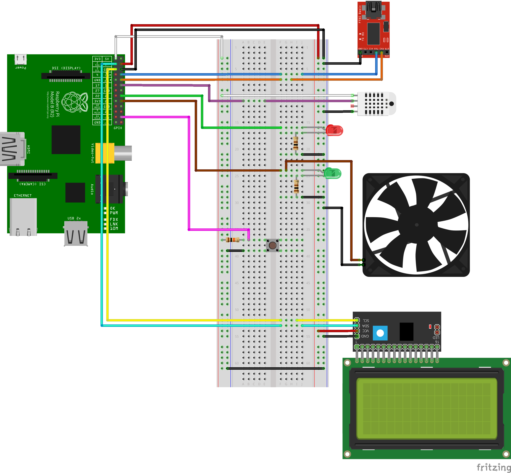

<link rel="stylesheet" type="text/css" href="stili.css">

# Introduzione

# Hardware

## Lista Componenti

|                 Nome                 | Quantità |
| :-----------------------------------: | :-------: |
|        Raspberry&trade;Pi 1 B        |     1     |
|        Cavo USB-A a Micro USB        |     1     |
|             MicroSD 32GB             |     1     |
|  FTDI FT232RL UART to USB interface  |     1     |
|              Breadboard              |     1     |
|             Sensore DHT22             |     1     |
|          Display I2C LCD2004          |     1     |
|           LED colore ROSSO           |     1     |
|           LED colore VERDE           |     1     |
|     Resistori da$\ 100 \Omega$     |     2     |
|      Ventola$\ 5 \mathrm V$ DC      |     1     |
|               Pulsanti               |     1     |
| Resistori da$\ 10 \mathrm k \Omega$ |     1     |
|        Cavo USB-A a Mini USB        |     1     |
|            Cavetti Jumper            |   Q. B.   |

## Breadboard Schematic



## Descrizione Componenti

### Raspberry&trade;Pi 1 B [1]

È il **dispositivo target** del progetto. Esso monta il [SoC Broadcom 2835](https://www.raspberrypi.org/app/uploads/2012/02/BCM2835-ARM-Peripherals.pdf) con processore ARM1176JZFS a $700 \mathrm{MHz}$ che, nonostante le caratteristiche non più all'avanguardia, si presta ancora bene nella gestione dei compiti richiesti.


Specifiche di sistema:

* SoC Broadcom BCM2835
* CPU ARM1176JZF-S core a $700 \mathrm{MHz}$
* GPU Broadcom VideoCore IV
* 512 MB RAM
* 2 Porte USB 2.0
* Video Output Composito (PAL e NTSC), HDMI o LCD diretto (DSI)
* Audio Output tramite Jack $3.5 \mathrm{mm}$ o Audio over HDMI
* Archiviazione: SD/MMC/SDIO
* 10/100 Ethernet (RJ45)
* Periferiche di Basso Livello:
  * 8 x GPIO
  * UART
  * bus I2C
  * bus SPI con due chip selects
  * $+3.3 \mathrm V$
  * $+5 \mathrm V$
  * GND
* Requisiti di alimentazione: $5 \mathrm V$ @ $700 \mathrm{mA}$ tramite MicroUSB o Header GPIO

### Modulo FTDI FT232RL


L'FTDI FT232RL è un convertitore USB-to-Serial, un dispositivo che traduce i dati tra il protocollo USB (Universal Serial Bus) e il protocollo seriale RS-232. Questo chip è ampiamente utilizzato per collegare dispositivi seriali, come microcontrollori, a computer moderni dotati di porte USB.

È noto per la sua semplicità d'uso e la compatibilità con numerosi sistemi operativi.

Può essere alimentato direttamente dalla porta USB del computer, eliminando la necessità di un'alimentazione esterna.

Questo modulo è necessario per fornire una porta di comunicazione virtuale al dispositivo di sviluppo (il PC) e consentire di inviare dati al dispositivo target (Il Raspberry Pi).

Il modulo FTDI è connesso al computer tramite la porta USB e alla UART1 del Pi secondo la seguente configurazione:

| FTDI Pin | Raspberry Pi Pin |
| :------: | :---------------: |
|    RX    |   GPIO14 / TXD0   |
|    TX    |   GPIO15 / RXD0   |
|   GND   |        GND        |

### Modulo Display I2C LCD2004 [2]


Il modulo Display I2C LCD2004 è un componente ampiamente utilizzato in progetti elettronici per visualizzare testo e informazioni su un display LCD (Liquid Crystal Display) alfanumerico con 20 caratteri per 4 righe.

Questo modulo è noto per la sua versatilità e facilità d'uso grazie all'**interfaccia I2C**, che semplifica notevolmente la connessione e il controllo da parte di microcontrollori e dispositivi embedded, oltre a ridurre notevolmente il numero di pin necessari per il collegamento.

Il sistema richiede l'uso di un display LCD 2004 per la presentazione delle informazioni all'utente finale ed è caratterizzato da una griglia 20 $\times$ 4 di **caratteri**, ciascuno dei quali costituito da un valore standard di 5 $\times$ 8 **dots**, codificati ASCII (la cui gestione da parte della ROM del modulo è visibile in figura).

<table style='border:none; text-align: center;'>
   <tr style='border:none'>
      <td rowspan="2" style='border:none'>
         
      </td>
      <td style='border:none'>
         
      </td>
   </tr>
   <tr style='border:none'>
      <td style='border:none'>
         
      </td>
   </tr>
</table>

Il modulo LCD2004 è connesso al Pi secondo la seguente configurazione:

| LCD2004 Pin | Raspberry Pi Pin |
| :---------: | :---------------: |
|     GND     |        GND        |
|     VCC     |        5V        |
|     SDA     |   GPIO2 / SDA1   |
|     SCL     |   GPIO3 / SCL1   |

### Modulo per la Serializzazione - I2C Backpack [3]

Si tratta di un modulo usato tipicamente per serializzare la comunicazione tra un microcontrollore e un altro device. Nel caso specifico, il modulo si presenta nella forma di un backpack da saldare al display (nel nostro caso era già saldato) e caratterizzato da quattro pin per il collegamento con il MCU:

* due pin, rispettivamente **VCC** e **GND**, usati per l'alimentazione del modulo;
* un pin, chiamato **SDA**, per l'invio dei dati serializzati;
* un pin, chiamato **SCL**, per la sincronizzazione dei segnali di clock.

A questi, si aggiungono altri 9 pin, di cui 8 usati come bus di dati e uno usato (eventualmente) per la gestione degli interrupt inviati dal MCU.

Il modulo richiede una tensione di $5 \mathrm V$ ed è provvisto di un potenziometro per il **controllo del contrasto** dei caratteri. Il controllo della luminosità è possibile via hardware, tramite una circuiteria *ad hoc*, o via software, tramite opportune istruzioni.

### Sensore di temperatura e umidità DHT22 [4]


Il sensore permette il monitoraggio della temperatura e dell'umidità nell'ambiente circostante, ed è caratterizzato da un sensore di base della famiglia AM2302, che si caratterizza per la capacità di gestione di segnali digitali con una precisione di 0.5 °C per la temperatura e di 2% RH per l'umidità, rilevando valori di temperatura tra i -40°C e i +80°C e di umidità tra lo 0% e il 100%.

Il sensore dispone di interfaccia seriale a filo singolo che ne facilita l'utilizzo. Il sensore DHT22 viene calibrato in modo estremamente preciso, essendo che i coefficienti di calibrazione sono memorizzati nella memoria OTP e vengono richiamati durante il processo di rilevamento: in questo modo non vi è alcuna necessità di ricalibrare il sensore.

La trasmissione dei dati avviene secondo uno specifico protocollo di comunicazione, suddiviso in due fasi:

1. La prima fase è quella in cui il microcontrollore invia un **segnale iniziale** al sensore, con quest'ultimo che risponde al microcontrollore.
   Dato che, inizialmente, il data bus del sensore è impostato su HIGH, la prima cosa che il microcontrollore deve fare è **abbassare** tale bus per almeno 1 ~ 10 ms (per dar modo al bus di rilevare tale comunicazione), salvo poi **rialzarlo** per 20 ~ 40 µs e **rimanere in attesa** della risposta del sensore.
   Nel momento in cui **il sensore AM2302** rileva il segnale di inizio, **abbassa** il data bus per 80 µs come risposta, salvo poi **rialzarlo** per altri 80 µs e iniziare l'effettiva trasmissione dei dati. L'intera prima fase avviene secondo un diagramma di tensione sul data bus come il seguente

   
2. La seconda fase, in cui avviene il rilevamento vero e proprio, prevede che il sensore invii **un bit per volta**, distinguendo tra 0 e 1 in base al tempo in cui il data bus viene mantenuto su HIGH dopo una fase in cui è stato tenuto LOW, sempre presente e della durata di 50 µs. Se la trasmissione del bit dura 26 ~ 28 µs, il bit trasmesso sarà uno 0, mentre, se la trasmissione durera ~ 70 µs, il bit trasmesso sarà un 1. La trasmissione di un bit segue un diagramma di tensione come i seguenti

   

I dati trasmessi ad ogni ciclo sono un totale di 40 bit, di cui i primi 16 costituenti l'**umidità relativa** (RH), i secondi sedici la **temperatura** (T) in gradi Celsius, e gli ultimi 8 bit una **checksum** per validare il rilevamento.

**N.B.** ad ogni rilevamento bisognerà seguire l'intero protocollo, dato che il sensore, senza aver ricevuto un segnale di avvio, non inizierà ad inviare dati.

La conversione da sequenza di bit a dato numerico è piuttosto semplice: basterà **dividere il valore** (espresso in base decimale) **per 10**, così da ricavare **parte intera** e **parte frazionaria** della grandezza fisica (es. `0x028C` corrisponde a 652, da cui si ricava un valore di 65.2).
Il calcolo della `sum`, in contrapposizione con la `checksum`, prevede che si separino i 32 bit misurati in byte, che si effettui la somma e che si consideri il byte finale. Se tale risultato è pari alla checksum, la trasmissione è avvenuta correttamente, altrimenti il contrario (es. `0x028C015F` produce una `sum` pari a `0xEE`).

### LEDs


Un LED, acronimo di Light Emitting Diode, è un dispositivo semiconduttore che emette luce quando una corrente elettrica passa attraverso di esso. Questi piccoli dispositivi sono diventati una parte fondamentale della tecnologia moderna, con applicazioni in una vasta gamma di settori.

Nel sistema in esame sono presenti due LED, uno rosso e uno verde, che hanno lo scopo di indicare la bontà dei parametri.

Il LED rosso lampeggiante indica che i valori sono fuori scala e bisogna fare qualcosa per riportarli alla normalità, mentre un LED verde acceso indica che i valori registrati sono buoni e l'ambiente è idoneo. Questa indicazione visiva ha lo scopo di trasmettere una informazione immediata agli utenti in quanto, essendo facilmente comprensibile, fornisce loro un feedback chiaro sullo stato ambientale.

I LED hanno due connessioni, l'**anodo** (+) e il **catodo** (-), che devono essere collegate correttamente per farli funzionare.

In un microcontrollore o in una scheda come il Raspberry Pi, i pin GPIO sono i nostri strumenti per controllare i componenti elettronici. Per connettere un LED, il suo anodo (+) viene collegato a uno dei pin GPIO, mentre il catodo (-) viene connesso a terra (GND).

Tuttavia, c'è un aspetto cruciale da tenere a mente: la necessità di una resistenza. Quando un LED è collegato direttamente a una sorgente di tensione senza una resistenza, la corrente può diventare troppo elevata e danneggiare il LED. Le resistenze svolgono il ruolo di "limitatori di corrente", regolando la quantità di corrente che fluisce attraverso il LED. La giusta resistenza assicura che il LED funzioni in modo sicuro e durevole.

Nella tabella sottostante sono riportati i pin GPIO attraverso i quali vengono pilotati i LED:

|  LED  | Raspberry Pi Pin |
| :---: | :---------------: |
|  RED  |      GPIO23      |
| GREEN |      GPIO24      |

### Pulsante


Il pulsante scelto è un pulsante a quattro pin, per uno switch a due poli. Per il suo scopo nel sistema è necessario che il pulsante sia configurato in pullup (il cui schema esemplificativo è presentato in figura), per cui, in fase di riposo (pulsante non premuto), la corrente può circolare, permettendo al sistema di funzionare, mentre, a seguito di una pressione, viene effettuata un'azione bloccante rispetto alla corrente, che impedisce al sistema di funzionare, mandandolo in reset.

Nella tabella sottostante sono riportati i pin GPIO attraverso i quali vengono pilotati i LED:

| Button Pin | Raspberry Pi Pin |
| :--------: | :---------------: |
| DATA WIRE |       GPIO8       |
|    VCC    |       +3V3       |
|   GROUND   |        GND        |

### Ventola di Raffreddamento 5V-3 pin


Si tratta di una ventola di dimensioni 60x60x10 mm, capace di lavorare a una tensione di 5V e garantire una velocità di rotazione di circa 3300 RPM, permettendo quindi un flusso d'aria di 13,8 CFM.

La ventola è connessa al Pi secondo la seguente configurazione:

| Fan Pin | Raspberry Pi Pin |
| :------: | :---------------: |
|   GND   |        GND        |
|   VCC   |        5V        |
|    EN    |      GPIO24      |

## GPIO assignment

Poiché questo progetto incorpora una serie di componenti esterni fondamentali per il suo funzionamento, è cruciale avere una panoramica chiara e ben organizzata dei pin GPIO coinvolti e delle rispettive funzioni a cui sono assegnati. Questa informazione è essenziale per garantire che il sistema funzioni in modo impeccabile e che i collegamenti tra i componenti siano stabiliti correttamente.

Nella tabella sottostante, vi è riassunta la panoramica dei pin GPIO utilizzati. Essa ha lo scopo di tenere traccia dei collegamenti e delle assegnazioni dei pin, semplificando la manutenzione futura e agevolando il lavoro di chiunque debba comprendere o estendere il progetto.

|   GPIO Pin   | Function    | Device              |
| :----------: | ----------- | ------------------- |
| GPIO2 / SDA1 | ALT0 / SDA1 | LCD2004             |
| GPIO3 / SCL1 | ALT0 / SCL1 | LCD2004             |
|    GPIO8    | INPUT       | BUTTON              |
|    GPIO18    | INPUT       | DHT22/AM2302        |
|    GPIO23    | OUTPUT      | LED Rosso           |
|    GPIO24    | OUTPUT      | LED Verde / Ventola |

# Environment

Per la fase di sviluppo sono stati utilizzati:

* PC con distribuzione Linux (Ubuntu) con installato G-Forth, minicom e picocom
* Interprete FORTH per soluzioni bare-metal [pijFORTHos](https://github.com/organix/pijFORTHos).

## pijFORTHos

## Preparazione Ambiente di Sviluppo

Dovendo lavorare in *bare-metal*, abbiamo pensato che i file di codice dovessero essere caricati al momento sul dispositivo, per cui abbiamo optato per un trasferimento lungo la connessione seriale, sfruttando il protocollo FTDI RS-232.

Nel sistema sorgente (quello su cui viene scritto il codice da inviare), su cui deve essere installata una distribuzione Linux (nel nostro caso Ubuntu 22.04 LTS),
avviare un terminale, ed eseguire i seguenti comandi per l'installazione di G-Forth e minicom:

```bash
$ sudo apt-get update
$ sudo apt-get install -y gforth
$ sudo apt-get install -y minicom
$ sudo apt-get install -y picocom
```

Minicom è un software di emulazione di terminale per sistemi operativi Unix-like da utilizzare per stabilire una comunicazione seriale remota (con il dispositivo target). Dopo averlo installato, bisogna configurarlo con i parametri specifici per il dispositivo target:

1. Avviare l'applicativo di configurazione da terminale con il comando `$ sudo minicom -s`
2. Usando le frecce, invio (*return*) ed esc per navigare nei menu:
   1. Selezionare l'opzione "Serial port setup"
   2. Seguendo le istruzioni a schermo:
      1. Modificare il *Serial Device*, impostandolo sulla posizione del dispositivo target collegato (tipicamente `/dev/ttyUSB0`)
      2. Modificare le impostazioni relative al baud rate, al bit di parità e ai data bits necessari alla comunicazione. Per il Raspberry&trade; Pi 1B sono:
         * baud rate a 115200 bps
         * bit di parità assente
         * 8 data bits
      3. Disattivare l'opzione "Hardware Flow Control"
      4. Uscire dal menu
   3. Selezionare l'opzione "Modem and dialing"
   4. Seguendo le istruzioni a schermo
      1. Impostare i Dialing prefix e Dialing suffix (1, 2 e 3) su stringhe vuote
      2. Uscire dal menu
   5. Salvare la configurazione come di default o come nuova configurazione (es. `raspi`)
3. Uscire dall'applicativo

Dopo aver salvato la configurazione, si potrà mettere minicom in ascolto secondo i parametri scelti digitando `$ sudo minicom [nome_configurazione]`

In alternativa, è possibile utilizzare **picocom** attraverso il comando `sudo picocom -b 115200 -r -l /dev/ttyUSB0 --imap delbs -s "ascii-xfr -sv -l100 -c10"`, in cui specifichiamo:

* baudrate a 115200 bps
* `--imap delbs` per usare il backspace per cancellare caratteri
* `-s "ascii-xfr -sv -l100 -c10"` permette di specificare il protocollo ASCII-XFR per lo scambio di file, con un ritardo di 100 ms tra l'invio di una riga e l'altra e un intervallo di 10 ms tra l'invio di un carattere e l'altro.

### Creazione `avvio_picocom.sh`

## Preparazione della Scheda SD e dell'Interprete

Per procedere all'installazione di pijFORTHos sulla scheda SD si possono seguire direttamente le istruzioni fornite dal gestore della repo *organix*, che riportiamo per completezza.

Direttamente da Raspbian OS:

1. Aprire il terminale
2. Clonare il repository attraverso il comando `$ git clone https://github.com/organix/pijFORTHos`
3. Accedere alla posizione della copia della repository con il comando `$ cd path/to/pijFORTHos`
4. Eseguire il comando `$ make clean all`

Questa procedura genera un file `kernel.img` ma, in caso di problemi, ne può essere utilizzato uno predefinito incluso nei file della repository
Dopo di che, eseguire i comandi

```bash
$ cp firmware/* /media/<SD-card>/
$ cp kernel.img /media/<SD-card>/
```

per copiare i file necessari per pijFORTHos nella scheda SD. Alla fine della procedura la scheda conterrà esattamente tre file

```
bootcode.bin
start.elf
kernel.img
```

È possibile, quindi, inserire la scheda SD nel Raspberry&trade; Pi, connetterlo al computer con il cavo USB-seriale e, con minicom/picocom avviato secondo le modalità dette in precedenza, collegare il Raspberry&trade; Pi all'alimentazione.

# Software

PRIMA DI PASSARE AL CODICE, VERRÀ ELENCATO IL FLUSSO DEGLI EVENTI, AL FINE DI UNA MAGGIOR COMPRENSIONE E REPLICABILITÀ DEL PROGETTO.

## Flusso di Lavoro

**ESEMPIO:**

1. Il sistema è in modalità di attesa, monitorando costantemente il pulsante dedicato per l'apertura o la chiusura del cancello.
2. Quando l'utente preme il pulsante di apertura, il sistema apre automaticamente il cancello.
3. Il sistema monitora costantemente il sensore di movimento lungo il percorso di chiusura del cancello.
4. Se il sensore di movimento rileva un movimento nell'area del cancello durante la chiusura, il sistema arresta immediatamente la chiusura del cancello per evitare collisioni.
5. Gli utenti autorizzati possono premere il pulsante di chiusura per chiudere manualmente il cancello.

## Codice

# Considerazioni Finali

Dopo una prima, lunga, fase di impostazione dell'attività progettuale, legata principalmente al reperimento della componentistica e all'apprendimento dell'ambiente di sviluppo (essendo la prima esperienza di programmazione a un così basso livello), possiamo affermare che la soluzione proposta rappresenti un punto di partenza per future espansioni e adattamenti a vari contesti, che vanno dalla domotica ad applicazioni industriali, in cui il rilevamento dei valori di temperatura e di umidità in tempo reale possa essere un *game-changer*.

In questo senso, possibili espansioni riguardano l'inserimento di attuatori e sensori che possano permettere alla soluzione di interfacciarsi con altri dispositivi e di fungere da regolatore del comportamento di questi ultimi, senza, peraltro, dover modificare il codice sorgente fin dove scritto: nel caso domestico, per esempio, si potrebbe pensare di centralizzare il controllo della temperatura aggiungendo pulsanti, per la determinazione dei valori desiderati, e altra componentistica, per permettere la comunicazione con le unità di controllo del clima (es. climatizzatori) e l'imposizione di tali valori fino al soddisfacimento di condizioni sia temporali che ambientali.

Inoltre, riteniamo che l'approccio seguito in fase di programmazione permetta al codice di poter essere riutilizzato anche su altri dispositivi target, semplicemente variando alcuni parametri di configurazione opportunamente astratti.

# References

[1] *"BCM2835 ARM Peripherals"*, Broadcom Corporation
[2] *"Specification For LCD Module 2004A"*, SHENZHEN EONE ELECTRONICS CO.
[3] *"PCF8574; PCF8574A Remote 8-bit I/O expander for I2C-bus with interrupt Rev. 5"*, NXP Microelectronics
[4] *"Digital relative humidity & temperature sensor AM2302/DHT22"*, Liu T.

## Flusso degli Eventi


Dopo aver collegato il dispositivo target all'alimentazione, aver permesso a pijFORTHos di avviarsi e aver inviato il codice da eseguire (secondo le modalità spiegate in seguito), il sistema accoglie l'utente con una scritta di benvenuto, dopo la quale effettua il primo rilevamento e stampa sul display il risultato. Successivamente, ogni *X* secondi e finché il dispositivo è alimentato, il sensore effettua rilevamenti e li mostra a schermo, in sostituzione del valore precedente.

## Codice

Nella scrittura del codice sorgente, si è provato a seguire un approccio modulare, inteso come suddiviso per aree di interesse, ma il file che deve essere trasmesso al dispositivo target dev'essere preferibilmente unico e ripulito da commenti utili solo in fase di debug, per cui abbiamo fatto ricorso ad un makefile per la generazione del file *TBD*

L'invio del file avviene attraverso minicom:

1. Avviare minicom digitando `$ sudo minicom [nome_configurazione]` da terminale
2. Premere la combinazione Ctrl+A S per aprire il prompt di invio file
3. Usando le istruzioni a schermo selezionare il protocollo di invio ASCII (per trattare il flusso di dati come un flusso di caratteri ASCII)
4. Nel menù contestuale digitare il percorso `path/to/file/TBD` del file sulla macchina sorgente (il PC Linux)
5. Attendere il caricamento del file sul Raspberry&trade; Pi e premere 'Invio'

## Descrizione dei Moduli

## Considerazioni Finali

# Bibliografia
